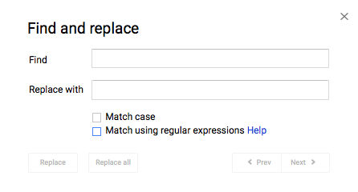

## Note – Regular Expressions

### Regular Expressions

**Regular expressions**, often shortened to **regex** (**reg**ular **ex**pressions) are used to describe patterns in a file or webpage.

When you are searching for a pattern, such as "lines that start with the letter Q or X", you can use a regular expression to accomplish that. When you are using CTRL-F (or ⌘-F for Mac users), there is often an option to use regular expressions.

For example, you can use regular expressions to find patterns in Google Docs. This is what the Find and Replace interface looks like in Google Docs.



| Syntax   | Description                                                  | Example           | Explanation                                                  |
| -------- | ------------------------------------------------------------ | ----------------- | ------------------------------------------------------------ |
| `()`     | Used as standard brackets in expressions.                    |                   |                                                              |
| `\|`     | Used for choices.<br></br>Think of it as an OR operator.     | (T\|t)hou         | Matches "Thou" or "thou".                                    |
| `+`      | Matches the preceding expression one or more times.          | The+              | Matches "The", "Thee", "Theee", etc.                         |
| `*`      | Matches the preceding expression zero or more times.         | Hey*              | Matches "He", "Hey", "Heyy", "Heyyy", etc.                   |
| `?`      | Matches the preceding expression zero or one time.           | Thou(gh)?         | Matches "Thou" and "Though".                                 |
| `{n, m}` | Matches the preceding expression between n and m times.      | No{1,7}           | Matches "No", "Noo", "Nooo", up until "Nooooooo".            |
| `^`      | Matches the start of a line.                                 | ^The              | Matches "The" at the beginning of any line.                  |
| `$`      | Matches the end of a line.                                   | end$              | Matches "end" at the end of any line.                        |
| `.`      | Matches any character.                                       | .at               | Matches occurrences of "at" that have a preceding character. |
| `[...]`  | Matches any character in the square brackets.<br></br>(A\|B\|C) behaves the same way as [ABC] | [bchm]at<br></br> | Matches "bat", "cat", "hat", and "mat".                      |
| `[^...]` | Matches any character not in the square brackets.            | [^p]at            | Matches occurrences of "at" except the ones that have a "p" before it. |
| `\`      | Escape character. Used for characters that belong to syntax. | `\.`              | Matches `.`.                                                 |

Tip: The regular expression `.*` matches any sequence of characters.

N.B.: The `^` and `$` metacharacters work best for text files. They are iffy in binary document files such as .docx and .xlsx.


### Regular Expressions in Python

Python has a module called `re` that implements regular expressions. You can `import` it to get access to functions such as `re.search()` and `re.findall()`.

The function `re.search()` takes a pattern and a string and returns a `Match` object if there is match and `None` otherwise. 

In the example below, the string `"hello world"` matches the pattern `"^h"` since it begins with `h` but it does not match the pattern `"^H"` since it doesn't begin with `H`.

```python
import re

print(re.search("^h", "hello world"))  # prints a Match object
print(re.search("^H", "hello world"))  # prints None since there was no match

```

The function `re.findall()` takes a pattern and a string and returns a list of all the substrings that match the pattern.

In the examples below, the pattern `"[t|T]h"` matches `"th"` and `"Th"` and the pattern `[a-z]*at[a-z]*` matches lowercase words that contain `at`.

```python
import re

print(re.findall("[t|T]h", "the Then that what other"))  # prints ['th', 'Th', 'th', 'th']
print(re.findall("[a-z]*at[a-z]*", "at that hat cat fog dog late"))  # prints ['at', 'that', 'hat', 'cat', 'late']
```
