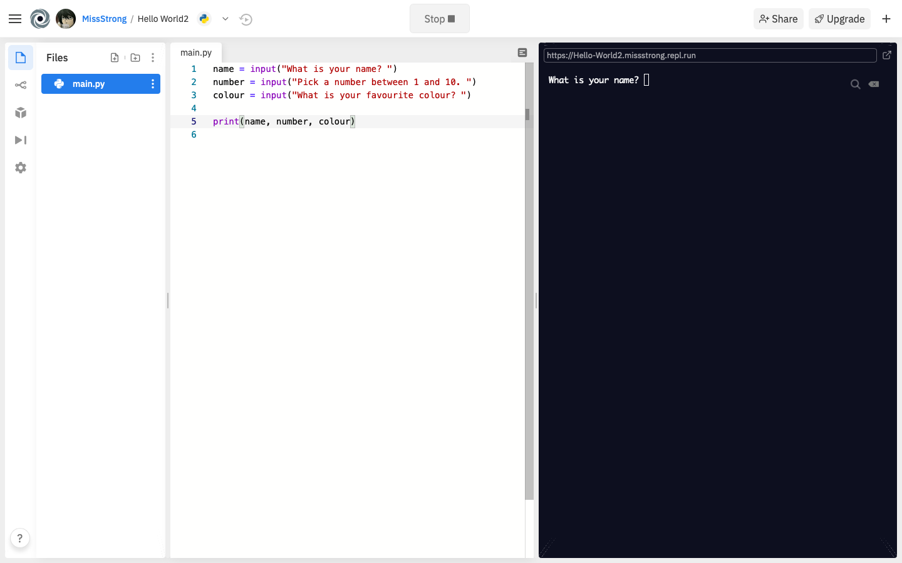
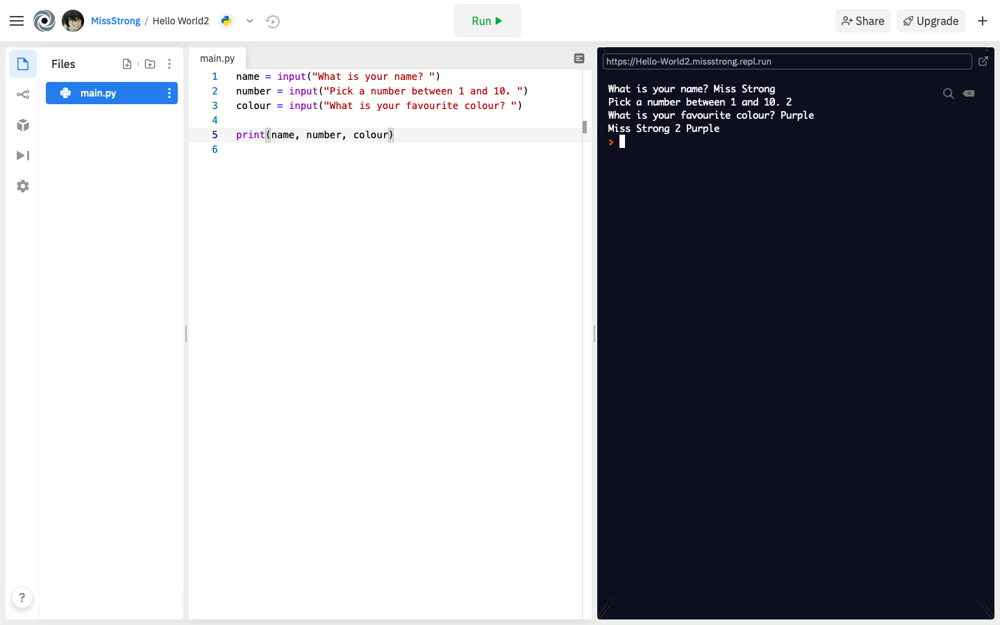

## Note – User Input

### input()

The console isn't just for outputting information. Users can type information into the console.

If you'd like to prompt a user for information, you can use the `input()` function. 

In the example below, there are three prompts.



After the three prompts have been provided, the program prints the three inputs.



Let's look at the code more carefully:

```python
name = input("What is your name? ")
number = input("Pick a number between 1 and 10. ")
colour = input("What is your favourite colour? ")
```

These three lines are the prompts. Each input is stored into a variable, `name`, `number`, or `colour` as a string. The space before the rightmost quotation marks provide space between the prompt and the response.

``` python
print(name, number, colour)
```

This line prints the three responses that were stored into the three variables. Each response is printed with one space between.
