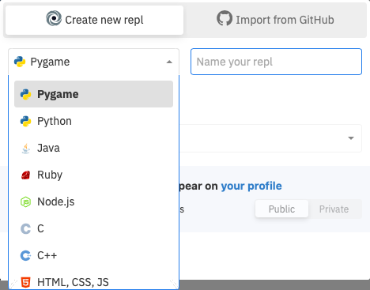

## Pygame

Pygame is a set of custom modules that allows us to display graphics in a window. It was created independently of the inventor of Python. It came out approximately 10 years after Python was first created.

### Pygame.org

The official website for Pygame is [pygame.org](http://www.pygame.org) and the documentation page is [pygame.org/docs](http://www.pygame.org/docs/).

On the documentation page, you can find information about  the different constants, variables, and functions you can use.

### Pygame in Repl.it

When we are using Pygame in repl.it, we need to select Pygame as the "language" of the repl. It's not actually a language, but on repl.it we need to select it as the langauge instead of Python in order for it to work.




There are a few lines of code that we need to include in every Pygame program.

```python
# Initial setup
import pygame
pygame.init()

# Sets the window to the size of 800x600
screen = pygame.display.set_mode((800, 600))

# Keeps the program running and updating
while True:
  pygame.display.update()

```

1. We first need to import the Pygame module and initialize it. 
2. We then need to create a screen to put the graphics on. The window in repl.it is 800 pixels by 600 pixels, so we can make our screen that size or smaller.
3. Lastly, we need to continuously update the display using an infinite loop. This will keep the program running indefinitly until we hit the Stop button.
